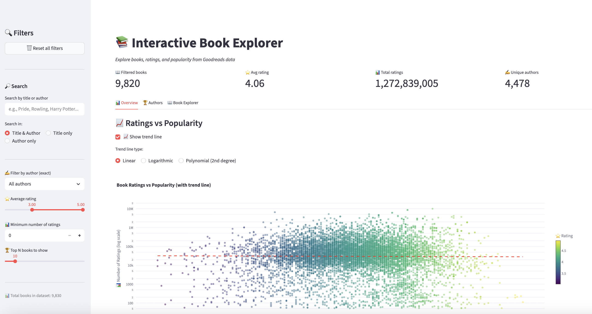
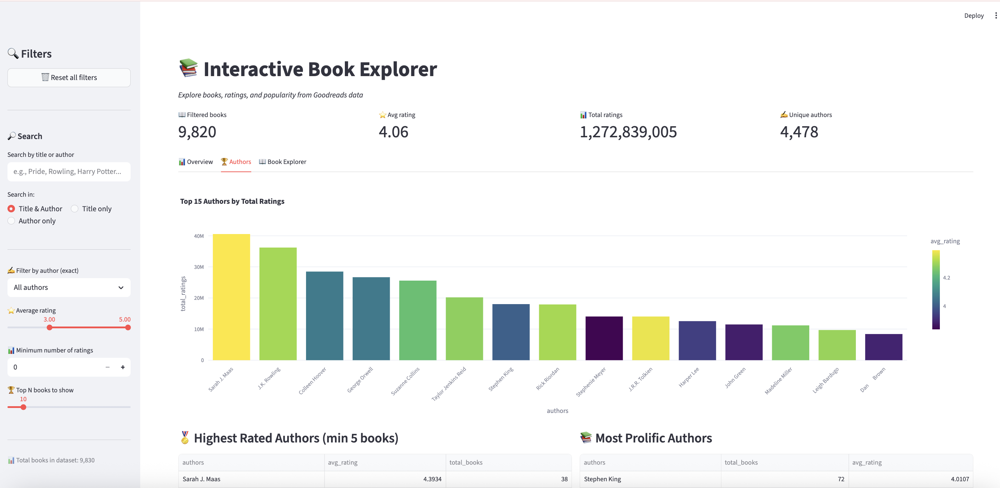
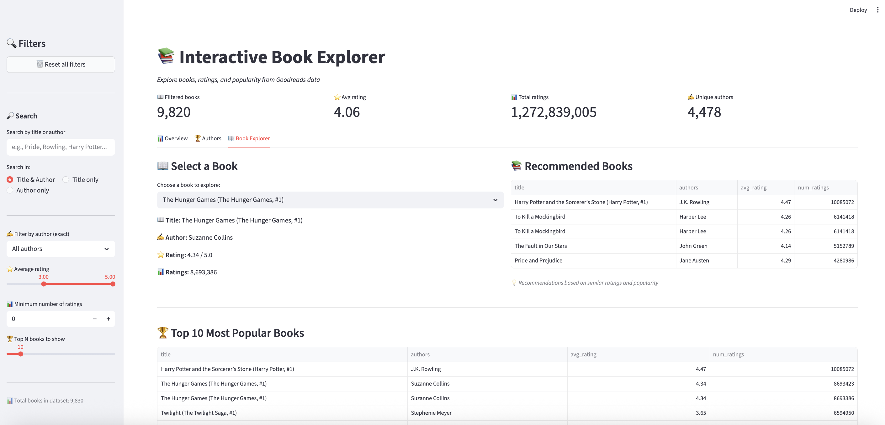

# 📚 Interactive Book Explorer

[](https://streamlit.io)
[](https://python.org)
[](https://plotly.com)

An interactive tool for visualizing and analyzing Goodreads book data.

## ✨ Features

- 🔍 **Search** by title and author
- 📊 **Interactive scatter plot** (rating vs popularity)
- 📈 **Trend lines** (3 types: linear, logarithmic, polynomial)
- 🏆 **Top authors** and top books
- 📚 **Recommendation system** based on rating and popularity similarity
- 🌙 **Light/Dark theme**
- 🔄 **Reset all filters**

## 📊 Screenshots

| Overview Tab | Authors Tab | Book Explorer |
|--------------|-------------|---------------|
|  |  |  |

## 🚀 Quick Start

### 1. Clone the repository

```bash
git clone https://github.com/YOUR_USERNAME/interactive-book-explorer.git
cd interactive-book-explorer
```
